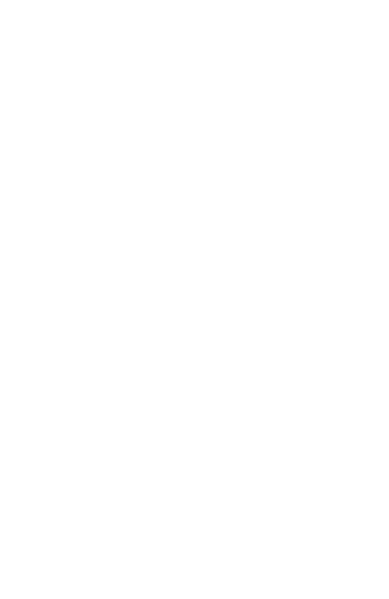

# Documentación Técnica del Diseño MUGA

## Estructura del Diseño

El proyecto MUGA implementa un diseño brutalist-minimalista con una estructura de cuadrícula (grid) que se adapta a diferentes dispositivos. A continuación se detalla la implementación técnica y las características específicas del diseño.

### Estructura HTML

La estructura principal del sitio se basa en una cuadrícula con cuatro elementos principales:

```html
<section class="grid-section">
  <div class="grid-container">
    <div class="grid-item dashed-border" id="item-1">
      
    </div>
    <div class="grid-item dashed-border" id="item-2">2</div>
    <div class="grid-item dashed-border" id="item-3">3</div>
    <div class="grid-item dashed-border" id="item-4">4</div>
  </div>
</section>
```

### Características del Diseño CSS

#### Sistema de Cuadrícula

- **Contenedor Principal**: Ocupa el 100% del viewport en altura y anchura
- **Estructura Base**: Grid de 2 columnas x 2 filas en desktop y tablet
- **Elemento Destacado**: La imagen "M" ocupa toda la columna izquierda en desktop y tablet
- **Bordes Visuales**: Todos los elementos tienen un borde punteado (dashed) con baja opacidad

#### Características Específicas

1. **Imagen M (item-1)**:
   - Alineada a la izquierda
   - Ocupa todo el alto del contenedor sin espacios en los bordes
   - Utiliza `object-fit: contain` en desktop y `object-fit: cover` en móvil
   - No tiene padding para permitir que llegue hasta los bordes

2. **Elementos Numéricos (item-2 y item-4)**:
   - Centrados en sus respectivas celdas
   - Tamaño de fuente adaptativo según el dispositivo (2rem en desktop, 1.8rem en tablet, 1.5rem en móvil)
   - Padding adaptativo para mantener la proporción visual

3. **Elemento Oculto (item-3)**:
   - No se muestra en ninguna vista ya que item-1 ocupa su espacio en desktop/tablet

### Diseño Responsive

El diseño se adapta a tres tamaños de pantalla principales:

#### Desktop (≥1280px)

```css
.grid-container {
  grid-template-columns: 1fr 1fr; /* Dos columnas iguales */
  grid-template-rows: 1fr;
}

#item-1 {
  grid-area: 1 / 1 / 3 / 2; /* Ocupa toda la columna izquierda */
}
```

- Altura: 100vh
- Distribución: 2 columnas iguales, con la imagen M ocupando toda la columna izquierda
- Tamaño de fuente para números: 2rem
- Padding de elementos: 20px

#### Tablet (768px - 1279px)

```css
.grid-container {
  grid-template-columns: 55% 45%; /* Proporción ajustada */
  grid-template-rows: 1fr 1fr;
}
```

- Altura: 100vh
- Distribución: 2 columnas con proporción 55%/45%, manteniendo la imagen M en toda la columna izquierda
- Tamaño de fuente para números: 1.8rem
- Padding de elementos: 15px

#### Móvil (<768px)

```css
.grid-container {
  grid-template-columns: 1fr; /* Una sola columna */
  grid-template-rows: 60% 20% 20%; /* Distribución vertical */
}

#item-1 {
  grid-area: 1 / 1 / 2 / 2; /* Solo primera fila */
}
```

- Altura: 100vh
- Distribución: 1 columna con 3 filas (60%, 20%, 20%)
- La imagen M ocupa solo la primera fila (60% de altura)
- Tamaño de fuente para números: 1.5rem
- Padding de elementos: 10px
- La imagen M utiliza `object-fit: cover` y `object-position: left center` para asegurar que llegue a los bordes superior e inferior

### Paleta de Colores Implementada

Actualmente, el diseño implementa los siguientes colores de la paleta definida:

- **#FFFFFF** - Blanco (Color del texto)
- **#191717** - Negro casi puro (Color de fondo)
- **rgba(255, 255, 255, 0.142)** - Blanco con baja opacidad (Bordes punteados)

### Optimizaciones Técnicas

1. **Rendimiento**:
   - Uso de `box-sizing: border-box` para cálculos de tamaño predecibles
   - Implementación de `object-fit` para manejo eficiente de imágenes
   - Media queries optimizadas para puntos de quiebre específicos

2. **Accesibilidad**:
   - Alto contraste entre texto y fondo
   - Estructura HTML semántica
   - Atributos alt en imágenes

3. **Compatibilidad**:
   - Propiedades CSS estándar con buena compatibilidad entre navegadores
   - Enfoque progresivo que funciona en navegadores modernos

### Próximos Pasos de Diseño

1. Implementación de los colores de acento (#FF5353, #5E3131) para elementos interactivos
2. Desarrollo de componentes adicionales siguiendo la estética brutalist-minimalista
3. Refinamiento de animaciones y transiciones para mejorar la experiencia de usuario
4. Implementación de tipografía personalizada según la identidad visual de MUGA

---

*Esta documentación contiene los detalles específicos de la implementación actual del diseño responsive y la estructura de cuadrícula.*